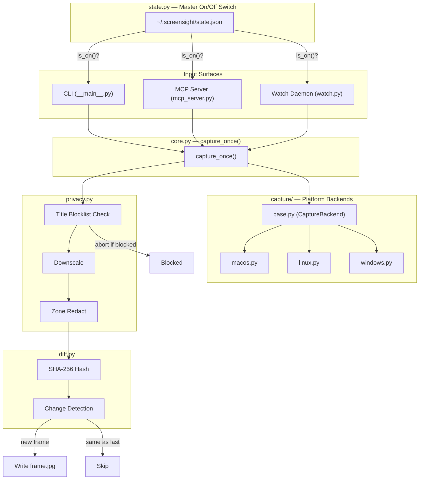

# ScreenSight

**Universal screen awareness for coding agents.** Let *any* coding agent see your screen — not just Claude Code. Ships as an MCP server, a CLI fallback, and a standalone watch daemon. No API key; runs on whatever subscription or session the agent already has.

## Why This Exists

Coding agents that can see your screen give far better debugging advice — but most solutions are locked to a single agent. Every other agent — Cursor, Windsurf, Cline, Codex CLI, Aider — either reinvents this or does without.

ScreenSight generalizes it:

- **MCP server** → works in any MCP-capable agent (Cursor, Windsurf, Cline, Claude Code, Codex CLI) with zero agent-specific code.
- **CLI** → works for agents with no MCP support (Aider, raw shell agents) by shelling out.
- **Watch daemon** → a long-lived background process that owns the interval/diffing logic once, so both the MCP tools and the CLI read its output instead of re-implementing polling.

## Features

| Feature | Description |
|---|---|
| Cross-platform | Native backends for macOS, Linux, and Windows (including WSL) |
| MCP + CLI | Two interfaces, same core — pick whichever your agent supports |
| Off by default | Master switch gates every capture; no silent background access |
| Sensitive-app blocklist | Password managers, incognito windows — captures abort automatically |
| Zone redaction | Define screen rectangles that always get blacked out |
| Frame hygiene | One frame file, overwritten each capture, deleted on `off` |
| Watch mode | Bounded daemon with auto-stop — a forgotten session can't burn tokens |
| Downscale | Frames reduced to 1568px long edge before leaving disk |

## Installation

Requires Python 3.10+.

```bash
pip install .
```

Or with `pipx` for an isolated install:

```bash
pipx install .
```

This provides two commands:
- `screensight` — the CLI
- `screensight-mcp` — the MCP server

## Per-Agent Integration

All MCP configs share the same shape — only the file path differs. Ready-to-use JSON files for each agent are in [`examples/`](./examples/).

| Agent | Config File | Example |
|---|---|---|
| Claude Code | `~/.claude.json` or `.mcp.json` | [`mcp_config_claude_code.json`](./examples/mcp_config_claude_code.json) |
| Cursor | `~/.cursor/mcp.json` | [`mcp_config_cursor.json`](./examples/mcp_config_cursor.json) |
| Windsurf | `~/.codeium/windsurf/mcp_config.json` | [`mcp_config_windsurf.json`](./examples/mcp_config_windsurf.json) |
| Cline | VS Code settings (`cline.mcpServers`) | [`mcp_config_cline.json`](./examples/mcp_config_cline.json) |
| OpenCode | `~/.config/opencode/opencode.json` | [`mcp_config_opencode.json`](./examples/mcp_config_opencode.json) |
| Roo Code | VS Code settings (`roo.mcpServers`) | [`mcp_config_roo_code.json`](./examples/mcp_config_roo_code.json) |
| Continue | `~/.continue/config.json` | [`mcp_config_continue.json`](./examples/mcp_config_continue.json) |
| Zed | `~/.config/zed/settings.json` | [`mcp_config_zed.json`](./examples/mcp_config_zed.json) |
| JetBrains | `~/.jetbrains/mcp.json` | [`mcp_config_jetbrains.json`](./examples/mcp_config_jetbrains.json) |
| Avante.nvim | `~/.config/nvim/mason/mcp.json` | [`mcp_config_mason_nvim.json`](./examples/mcp_config_mason_nvim.json) |
| CodeCompanion | Neovim plugin config | See README section above |
| Codex CLI | `~/.codex/config.json` | [`mcp_config_codex.json`](./examples/mcp_config_codex.json) |
| Aider | CLI only (no config) | See CLI example below |

### CLI-Only Agents (Aider, Shell Scripts, etc.)

No config needed. The CLI works standalone:

```bash
screensight on        # Enable screen access
screensight capture   # Capture current screen
screensight off       # Disable when done
```

Frame is saved at `~/.screensight/frame.jpg` — the agent reads it as a normal file/image argument.

## CLI Usage

```
screensight on                           # Enable screen capture
screensight off                          # Disable and delete cached frame
screensight status                       # Check whether access is on

screensight capture [--display N]        # Capture current screen
screensight watch [--interval N] [--max-frames N]  # Start bounded watch session
screensight watch-stop                   # Stop running watch daemon
screensight watch-status                 # Check watch daemon status
screensight displays                     # List available monitors
```

| Command | Description |
|---|---|
| `on` | Enable screen capture access |
| `off` | Disable access and delete `frame.jpg` |
| `status` | Print current on/off state |
| `capture` | Capture the screen, print frame path as JSON |
| `watch` | Start a background daemon that polls on an interval |
| `watch-stop` | Stop a running watch daemon |
| `watch-status` | Check daemon status (frame count, last change) |
| `displays` | List available displays/monitors |

**Exit codes:**

| Code | Meaning |
|---|---|
| `0` | Success |
| `3` | Screen access is off or capture failed |

## MCP Tools

When connected via MCP, the server exposes these tools:

| Tool | Description |
|---|---|
| `screen_enable` | Turn on screen access (required before any capture) |
| `screen_disable` | Turn off screen access and delete cached frame |
| `screen_status` | Check current state and list available displays |
| `screen_capture` | Capture the screen, returns frame path + active window title |
| `screen_watch_start` | Start a bounded watch session with auto-stop |
| `screen_watch_stop` | Stop a running watch daemon |
| `screen_watch_status` | Check daemon status |
| `screen_list_displays` | List all available monitors |

## Privacy & Security

ScreenSight is designed with privacy as a first-class concern, not an afterthought.

### Master Switch

Screen capture is **off by default**. The check happens inside the capture pipeline itself (`core.capture_once()`), not in a prompt or tool description — so no instruction, injected or otherwise, can talk the tool into capturing while it's off.

### Sensitive-App Blocklist

Before a frame is written, the active window title is checked against a blocklist. Matches abort the capture — nothing is saved, nothing is sent.

**Default blocklist:** `1password`, `bitwarden`, `keychain access`, `keepass`, `lastpass`, `password`, `private browsing`, `incognito`.

Extend via `~/.screensight/redact_zones.json`:

```json
{
  "blocklist": ["1password", "my-banking-app"],
  "zones": []
}
```

### Zone Redaction

Define fixed screen rectangles that always get blacked out, regardless of what's displayed:

```json
{
  "blocklist": [],
  "zones": [
    {"x": 0, "y": 0, "w": 400, "h": 300},
    {"x": 1200, "y": 800, "w": 500, "h": 200}
  ]
}
```

### Frame Hygiene

- **One frame file** (`~/.screensight/frame.jpg`) — overwritten each capture, never accumulates.
- **Deleted on `off`** — `screensight off` removes the frame from disk.
- **Downscaled** — frames reduced to 1568px long edge before anything leaves disk.

### Watch Mode Limits

- **Max 10 analyzed frames** per watch invocation (configurable via `--max-frames`).
- **Auto-stops** when the cap is reached.
- **Auto-disables** screen access when the watch session ends — an idle daemon can't quietly keep running.

## Architecture

See [ARCHITECTURE.md](./ARCHITECTURE.md) for the full data flow diagram and module breakdown.



## Platform Support

| Platform | Backend | Active Window Title |
|---|---|---|
| macOS | `screencapture` | `osascript` (AppleScript) |
| Linux | `grim` / `gnome-screenshot` / `import` | `xdotool` |
| Windows | PowerShell + `System.Drawing` | Win32 API |
| WSL | PowerShell (via `WSLCapture`) | Win32 API |

## Dependencies

| Package | Purpose |
|---|---|
| `fastmcp` | MCP server framework |
| `pillow` | Image downscaling |

No screenshot libraries — capture uses native OS tools via `subprocess` (keeps the "no extra app" property).

## State Files

All stored under `~/.screensight/`:

| File | Purpose |
|---|---|
| `state.json` | Master on/off switch |
| `frame.jpg` | Current screenshot (overwritten each capture) |
| `redact_zones.json` | Blocklist terms + redaction rectangles |
| `daemon.json` | Watch daemon status |
| `daemon.pid` | Watch daemon process ID |

## License

MIT
