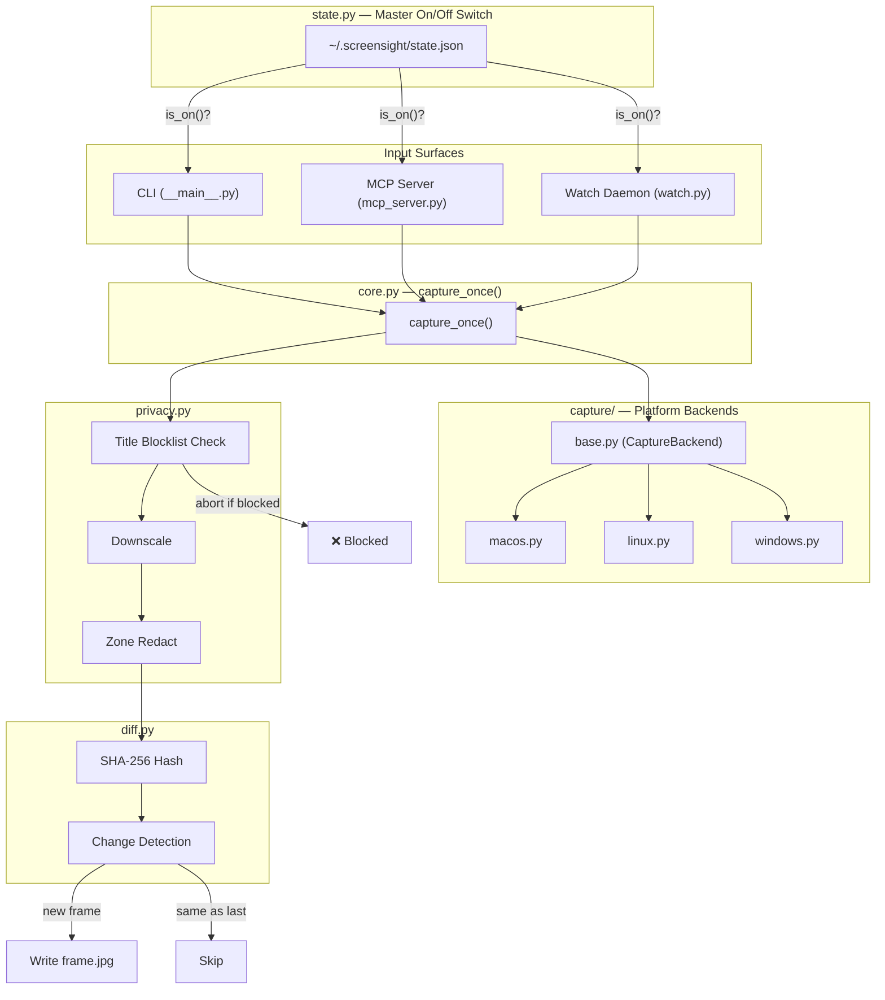

# Architecture

## Data flow



## Three surfaces, one core

- **CLI** (`__main__.py`) — synchronous, human- or shell-script-facing. Talks to `core.py`
  and `watch.py` directly, formats results as text.
- **MCP server** (`mcp_server.py`) — agent-facing. Same calls as the CLI, wrapped as
  FastMCP tools with agent-readable docstrings. Returns MCP `Image` content blocks, not
  file paths, so the calling agent can look at the frame directly in its own context.
- **Watch daemon** (`watch.py`, run as a detached OS process) — the only surface that runs
  unattended. Owns the interval loop; CLI and MCP server both just start, stop and poll it
  rather than each implementing their own. This is why the daemon is a separate process
  rather than a background thread inside the MCP server: the MCP server's process lifetime
  is tied to the agent session (often stdio, often per-request), which is the wrong
  lifetime for "check my screen every 5 seconds."

## Why `core.capture_once()` is the choke point

Every safety property — switch check, blocklist, redaction, downscale, hashing — is
composed once, in order, inside `capture_once()`. Any new surface (a future web UI, a
future gRPC endpoint, whatever) gets all of them for free by calling that one function.

The moment a second code path calls a `capture/*.py` backend directly, the safety
properties can silently diverge between surfaces. Treat that as a bug, not a style
preference.

## State files

All under `~/.screensight/`:

| File | Written by | Read by | Purpose |
|---|---|---|---|
| `state.json` | `state.py` | `core.py` | Master on/off switch |
| `frame.jpg` | `core.py` (via `privacy.process_frame`) | CLI, MCP tools | The one current screenshot, overwritten each capture |
| `redact_zones.json` | User (hand-edited or agent-edited) | `privacy.py` | Blocklist terms + redaction rectangles |
| `daemon.json` | `watch.py` daemon loop | CLI `watch-status`, MCP `screen_watch_latest` | Running/stopped, frame count, last change timestamp |
| `daemon.pid` | `watch.py` (on start) | `watch.py` (on stop) | So `watch-stop` can find the process |

## Platform backend contract

Every `capture/*.py` module implements `CaptureBackend`:

- **`screenshot(out_path, display=None) -> CaptureResult`** — must be a native OS tool call
  via `subprocess`, never a Python screenshot library. This keeps the "no extra app, no
  extra deps" property.
- **`active_window_title() -> str | None`** — best-effort. `None` means "couldn't
  determine," and every caller must treat that as **not verified safe**, not as "safe."
- **`list_displays() -> list[dict]`** — at minimum `[{"index": 0, "name": "primary"}]` as a
  fallback.

## Module map

```text
src/screensight/
  __init__.py          # Package init
  __main__.py          # CLI entry point (argparse)
  config.py            # Paths, constants, blocklist defaults
  state.py             # Master on/off switch
  core.py              # capture_once() — single entrypoint
  privacy.py           # Blocklist check, downscale + zone redaction
  diff.py              # SHA-256 hashing, change detection
  watch.py             # Daemon (start/stop/status + loop)
  mcp_server.py        # FastMCP server (8 tools)
  capture/
    base.py            # CaptureBackend ABC + get_backend() OS dispatch
    macos.py           # macOS (screencapture + osascript)
    linux.py           # Linux (grim / gnome-screenshot / import)
    windows.py         # Windows + WSL (PowerShell + System.Drawing)

tests/
  test_state.py        # On/off round trip
  test_privacy.py      # Blocklist matching, zone scaling
  test_diff.py         # Hash stability, change detection
  test_core.py         # capture_once() with a mocked backend
```
